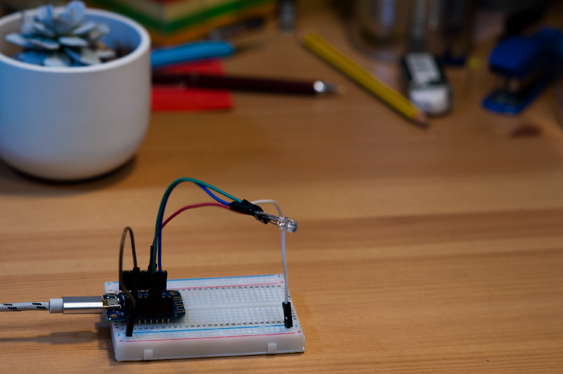

# Welcome

### What we are going to do

We are going to build an Arduino project that mimics a **Smart RGB Light Bulb**. The project will connect to the internet on its own and get its configuration from the **Firebase Realtime Database**. 

We will then connect our project to the **Actions on Google** platform, and we will be able to command our light by using the **Google Home** app, or any other device with the **Google Assistant.**

### Objective

The main goal is to **have fun** writing simple **code** and **learn** new things **together**, but what exactly is it that we are going to learn?

In this workshop we will learn how to create our own Smart RGB light bulb that responds to voice commands through the Google Assistant. By the end you will have learned:

* How to wire up a simple Internet of Things project using an esp8266 board and

  Adafruit's NeoPixels

* How to install and configure your Arduino IDE to work with esp8266 boards
* How to connect to and get real-time updates from the Firebase Realtime

  Database from your Arduino project

* How to write an API integration with the actions-on-google SDK
* How to set up an API integration with the Smart Home API from Actions on

  Google

### Expected result

You will be able to ask the Google Assistant to 

* Turn on  the light
* Turn off the light
* Set the light to green
* Set the light to 50%

You can use any other natural language commands that might apply to an off-the-shelf smart light bulb.

### Reference code

The final result is available on GitHub at [orestes/actions-on-google-smart-light](https://github.com/orestes/actions-on-google-smart-light)

This repo contains

* The Arduino code for the smart light project
* The Firebase Cloud Functions code to integrate with the Actions on Google Smart Home API 
* The front-end login screen to fake authenticating users when they link their accounts on the Google Home app


You need some hardware to follow along. Don't skip ahead, check out the [components list](requisites.md) first.


